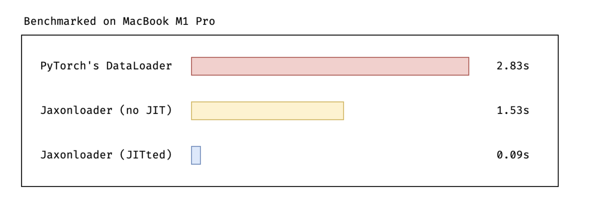

# Jaxonloader

A blazingly fast ⚡️ dataloader for JAX that no one asked for, but here it is anyway.

### Yet another dataloader? Why...

Yes, it's true: the world may not need another dataloader, but I got tired of converting Torch tensors to JAX arrays and having this overhead everytime I want to train a model. So I decided: No more of that! It has to change!

### Ok, but what does this do?

In essence, Jaxonloader is simply a very thin layer around a JAX array. The idea is that you first analyse and preprocess your data using Polars or Pandas and once you have a `DataFrame` you're happy with and want to start training your model _only_ then comes Jaxonloader into play. You generate a `JaxonDataset` from a `DataFrame` and pass that into a `JaxonDataLoader`. The dataloader itself can be JITted, giving us a **massive** speedbost in training.

### So all you're doing is iterating over a JAX array?

Yes. Do you really need more than that?

### I guess you're right. ...Wait it's faster? How much?

Since we can JIT the dataloader, we can have a 31x increase in iteration time over the PyTorch dataloader.

